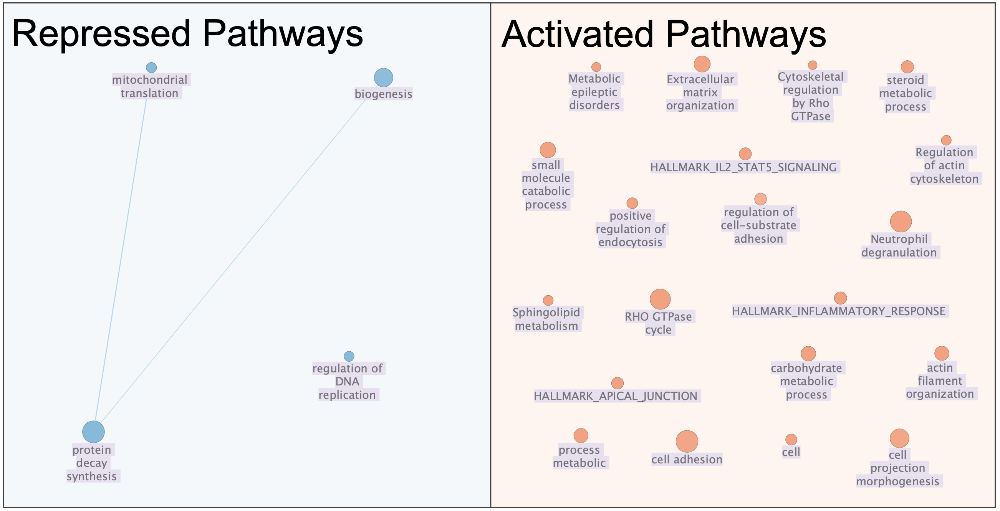

# Introduction

Triple-Negative Breast Cancer (TNBC) is a particularly aggressive subtype of breast cancer, known for its high mortality rate [@americancancersociety_2023]. Although cancer research continues to evolve rapidly, the immune landscape of individuals affected by TNBC remains largely uncharacterized. Previous studies have demonstrated that tumors can alter immune system responses, resulting in differences in disease progression and treatment outcomes [@blomberg_2018; @mcallister_2014]. Neutrophils, a type of white blood cell, are crucial for immune defense, as they release enzymes that break down microorganisms and activate other immune cells, making them a vital component of the immune response [@nationalcancerinstitute_2019].

To investigate immune responses in TNBC patients, Bakker et al. performed a bulk RNA-seq experiment to analyze differential gene expression in neutrophils from both TNBC patients and healthy donors [@bakker_2025]. Expanding on their findings, we re-examine their bulk RNA-sequencing data to explore gene expression patterns in TNBC patients. Their dataset has been made publicly available in the Gene Expression Omnibus (GEO) under accession number GSE264108 [@barrett_2012].

In our [first analysis](#data-cleaning-and-processing-of-bulk-rna-sequencing-data), we processed this dataset by removing low read counts and duplicated data before applying Trimmed Mean of M-values (TMM) normalization. After cleaning and normalizing the data, our bulk RNA-sequencing experiment retained 3690 genes. The dataset consists of neutrophils from 7 mTNBC patients in the test group and 7 healthy donors in the control group.

Furthermore, we performed a [second analysiss](#differential-gene-expression-and-preliminary-over-representation-analysis) including a differential gene expression and over-representation analysis on the gene set obtained from Bakker et al.’s study. Our findings indicate that neutrophils in TNBC patients are enriched for pathways related to cell migration and neutrophil granule proteins, aligning with the results of their research. Additionally, we observed a down-regulation of mitochondrial translation proteins in TNBC samples, a condition that has been linked to breast cancer in previous studies [@koc_2022; @wang_2021].

For our [third analysis](#dataset-pathway-and-network-analysis), we will conduct enrichment analysis on our dataset, to identify pathways that are enriched for up or down regulation in TNBC samples. 

---

# Data Cleaning and Processing of Bulk RNA-Sequencing Data
The first analysis can be found [here](A1_KatarinaVucic.html).

---

# Differential Gene Expression and Preliminary Over-Representation Analysis
The second analysis can be found [here](A2_KatarinaVucic.html).

---

# Dataset Pathway and Network Analysis

We begin by importing relevant packages for our analysis. We will be using kable extra [@kableextra_2021], knitr [@xieaut_2022], and htmltools [@a2024] for improved display; dplyr [@dplyr_2020] for data manipulation; and RCurl for downloading over the web [@lang_2025].

```{r, message=FALSE, warning=FALSE, error=FALSE, results='hide'}
library(knitr)
library(kableExtra)
library(htmltools)
library(dplyr)

if (!requireNamespace("RCurl", quietly = TRUE)) {
  install.packages("RCurl")
}
library(RCurl)
```

First, we will import our normalized TNBC data. 

```{r, message=FALSE, warning=FALSE}
# load in data from csv file
normalized_tnbc_data <- read.csv("A2_normalized_tnbc_data.csv")

write.table(normalized_tnbc_data, "normalized_tnbc_data.txt", sep="\t", row.names=FALSE)

# reset index and remove the row
rownames(normalized_tnbc_data) <- normalized_tnbc_data$X
normalized_tnbc_data$X <- NULL

# display the data
kable(normalized_tnbc_data, format = "html", caption = "  Table 1: Normalized read counts for TNBC vs Healthy Neutrophils") %>%
  kable_styling(bootstrap_options = "striped", full_width = FALSE) %>% # striped rows for readability, constrain width
  scroll_box(height = "400px") # set the height of the box so it won't be too big
```

*This code was inspired by the response by Matthew Lundberg to this Stack Overflow question [@brno792_2013], and the kable display was inspired by [@stevec_2020] and [@tierney_2020].*

Let's load in the sample dataframe next.

```{r, message=FALSE, warning=FALSE}
# load in data from csv file
sample_info_data <- read.csv("A2_sample_info_data.csv")

# reset index and remove the row
rownames(sample_info_data) <- sample_info_data$X
sample_info_data$X <- NULL

# display the data
kable(sample_info_data, format = "html", caption = "Table 2: Sample information for TNBC and healthy neutrophils.") %>%
  kable_styling(bootstrap_options = "striped", full_width = FALSE) %>% # striped rows for readability, constrain width
  scroll_box(height = "400px") # set the height of the box so it won't be too big
```

*This code was inspired by the response by Matthew Lundberg to this Stack Overflow question [@brno792_2013].*

We have biological sample information for all 14 samples, with 7 from healthy donors and 7 from TNBC donors. Additionally, we have information about which clinical trial each TNBC sample is from, Tonic or TNB.

Finally, we will load in our differential expression results.

```{r, message=FALSE, warning=FALSE}
# load in data from csv file
differential_expression_data <- read.csv("A2_differential_expression_results.csv")

# reset index and remove the row
rownames(differential_expression_data) <- differential_expression_data$X
differential_expression_data$X <- NULL

# display the data
kable(differential_expression_data, format = "html", caption = "Table 3: Differential expression data for TNBC and healthy neutrophils.") %>%
  kable_styling(bootstrap_options = "striped", full_width = FALSE) %>% # striped rows for readability, constrain width
  scroll_box(height = "400px") # set the height of the box so it won't be too big
```

Now we have all of the data ready to perform our analysis.

---

# Non-thresholded Gene Set Enrichment Analysis

For non-thresholded gene set enrichment analysis, we will run GSEA through the command line using R, following this workshop tutorial (https://risserlin.github.io/CBW_pathways_workshop_R_notebooks/run-gsea-from-within-r.html) [@isserlin].

We need to retrieve a geneset to extract our pathways from. We will use the Bader lab's latest Human gene symbols as our pathway reference.

```{r, message=FALSE, warning=FALSE}
gmt_url = "http://download.baderlab.org/EM_Genesets/current_release/Human/symbol/"

# list all the files on the server
filenames = getURL(gmt_url)
tc = textConnection(filenames)
contents = readLines(tc)
close(tc)

# get the gmt that has all the pathways and does not include terms inferred
# from electronic annotations(IEA) start with gmt file that has pathways only
rx = gregexpr("(?<=<a href=\")(.*.GOBP_AllPathways_noPFOCR_no_GO_iea.*.)(.gmt)(?=\">)", contents, perl = TRUE)
gmt_file = unlist(regmatches(contents, rx))
dest_gmt_file <- file.path("/home/rstudio/projects", gmt_file)

if(!file.exists(dest_gmt_file)){
    download.file(
      paste(gmt_url, gmt_file, sep=""),
      destfile=dest_gmt_file
    )
}
```
*This code was modified from the lectures for BCB420: Computational Systems Biology [@isserlin_2025].*

Next, we will set up the paramters neccessary to run GSEA. The params can be changed in the YAML at the top of this file. By default, the `params$run_gsea` flag is set to FALSE for faster compilation. To run a new instance of GSEA, switch the flag to TRUE. The docker image for this paper, `risserlin/bcb420-base-image:winter2025`, contains the jar file for running GSEA and can be found [here]((https://hub.docker.com/r/risserlin/bcb420-base-image/tags)). If working in another docker, place the GSEA jar in a reachable directory and modify `params$gsea_jar`.

```{r, message=FALSE, warning=FALSE}
# path to the GSEA jar file
gsea_jar <- params$gsea_jar

# directory where all the data files are found.
working_dir <- params$working_dir

# directory where all the data files are found. 
output_dir <- params$output_dir

# The name to give the analysis in GSEA - for example Basal_vs_Classical
analysis_name <- params$analysis_name

# rank file to use in GSEA analysis
rnk_file <- params$rnk_file

# run_gsea - true/false (for the compilation of the notebook) 
run_gsea <- params$run_gsea
```
*This code was modified from the lectures for BCB420: Computational Systems Biology [@isserlin_2025].*

Next, we will compute the rank using the p-value and fold-change from our differential expression analysis [@isserlin_2025].

```{r, message=FALSE, warning=FALSE}
# create ranked genes df
ranked_genes <- differential_expression_data %>%
  dplyr::arrange(PValue) %>%
  dplyr::mutate(rank = -log10(PValue) * sign(logFC)) %>% 
  dplyr::select(gene, rank)


# save ranked genes to .rnk file
write.table(
  ranked_genes,
  file = rnk_file,
  sep = "\t",
  row.names = FALSE,
  col.names = FALSE,
  quote = FALSE
)
```
*This code was modified from the lectures for BCB420: Computational Systems Biology [@isserlin_2025].*

```{r, message=FALSE, warning=FALSE}

if(run_gsea){
  command <- paste("",gsea_jar,  
                   "GSEAPreRanked -gmx", dest_gmt_file, 
                   "-rnk" ,file.path(working_dir, rnk_file), 
                   "-collapse false -nperm 1000 -scoring_scheme weighted", 
                   "-rpt_label ",analysis_name,
                   "  -plot_top_x 20 -rnd_seed 12345  -set_max 200",  
                   " -set_min 15 -zip_report false ",
                   " -out" ,output_dir, 
                   " > gsea_output.txt",sep=" ")
  system(command)
}

```
*This code was modified from the lectures for BCB420: Computational Systems Biology [@isserlin_2025].*

---

## Results

Now that we have run our analysis, we have an HTML file in the results file that we can look at. The pre-generated one can be found [here](~/projects/GSEA_results/TNBC_vs_Healthy.GseaPreranked.1743375480688) and is displayed below. 
```{r, message=FALSE, warning=FALSE}

gsea_directories <- list.files(path = output_dir, pattern = "\\.GseaPreranked")

#get the details on the files
details = file.info(file.path(output_dir,gsea_directories))
#order according to newest to oldest
details = details[with(details, order(as.POSIXct(mtime),decreasing = TRUE)), ]

#use the newest file:
gsea_output_dir <- row.names(details)[1]

gsea_results_filename <- file.path(gsea_output_dir,"index.html")
```
*This code was modified from the CBW Workshop [@isserlin_2024].*

```{r, message=FALSE, warning=FALSE}
# embed the HTML file using an iframe
tags$iframe(
  src = gsea_results_filename,
  height = "800px",
  width = "100%",
  frameborder = "0"
)

```
*This code was inspired by the response by Mike Williamson to this Stack Overflow question [@williamson_2016].*

This file contains a lot of information, that might take days to uncover. To speed up this process, we will generated an enrichment map to summarize our results!

---

## Enrichment Map

We will create an enrichment map using our GSEA results. For this, we will use Cytoscape, a web tool for generating network plots and its package EnrichmentMap Pipeline Collection [@shannon_2003; @reimand_2019]. This analysis was inspired by the tutorial provided [here](https://baderlab.github.io/CBW_Pathways_2024/gsea_mod3.html) [@voisin_2025]. A full tutorial is available in the linked video [here](https://drive.google.com/file/d/1I99DGEaaILFUarOYFKvtK1q-scXbUTrK/view?usp=sharing). 

### Install Cytoscape

- Download and install Cytoscape from [here](https://cytoscape.org/).
- Install the EnrichmentMap Pipeline Collection from [here](https://apps.cytoscape.org/apps/enrichmentmappipelinecollection).

### Set Up Data

To create the enrichment map, we used a prior run of GSEA that can be found in the `~/projects/GSEA_results/TNBC_vs_Healthy.GseaPreranked.1743375480688` folder. Use the default parameters listed below, or modify the directory to reference the most recent GSEA run by changing the directory name to the most recent run.

### Data Sets

- **Name:** TNBC_vs_Healthy.GseaPreranked  
- **Analysis Type:** GSEA  
- **Enrichments (positive):** `.../Katarina_Vucic/GSEA_results/TNBC_vs_Healthy.GseaPreranked.1743375480688/gsea_report_for_na_pos_1743375480688.tsv`  
- **Enrichments (negative):** `.../Katarina_Vucic/GSEA_results/TNBC_vs_Healthy.GseaPreranked.1743375480688/gsea_report_for_na_neg_1743375480688.tsv`  
- **GMT File:** `.../Katarina_Vucic/GSEA_results/TNBC_vs_Healthy.GseaPreranked.1743375480688/Human_GOBP_AllPathways_noPFOCR_no_GO_iea_March_01_2025_symbol.gmt`  
- **Ranks File:** `.../Katarina_Vucic/GSEA_results/TNBC_vs_Healthy.GseaPreranked.1743375480688/ranked_gene_list_na_pos_versus_na_neg_1743375480688.tsv`  
- **Expression Data:** `.../Katarina_Vucic/GSEA_results/TNBC_vs_Healthy.GseaPreranked.1743375480688/normalized_tnbc_data.txt`  
- **Phenotypes:** Positive - TNBC, Negative - Healthy  
- **FDR Q-value Cutoff:** 0.05  

This will generate a network looking something like this. 

```{r, message=FALSE, warning=FALSE, fig.cap="Figure 1: Initial enrichment map when you load the datasets into Cytoscape."}

```

To get the metadata of the network, go to **Tools > Analyze Network**.

```{r, message=FALSE, warning=FALSE, fig.cap="Figure 2: The metadata for our enrichment map network."}

```

### Add Clustering

Use the **AutoAnnotate** panel to add a clustering group with the following annotations:
- **Cluster Creation**: Use clusterMaker2 App
- **Layout network to minimize cluster overlap**: checkmark
- **Label Creation**: Use WordCloud app
- **Label Column**: GS_DESCR
- **Max words per label**: 3
- **Minimum word occurence**: 3

### Adjust Layout

Go to **Layout > Settings...** and select one cluster at a time.
- Set **Default Spring Length** to 350 for the SRP Protein Decay Synthesis Group.

### Add Styling

Open the *Style* panel and make the following adjustments. You may need to select attributes from the *More Properties...* panel if you do not see them on the list.
- **Label Position:**
  - Node Anchor Points: South
  - Label Anchor Points: North
- **Label Transparency:** 200
- **Label Font Size:** 36
- **Label Background Shape:** Rectangle
- **Label Background Color:** Pink

### Final Adjustments

Manually adjust the nodes to avoid text overlap. Optionally, rearrange and add text for easier viewing. Once complete, your enrichment map should look similar to the figure below.

## Final Enrichment Map

```{r, message=FALSE, warning=FALSE, fig.cap="Figure 3: TNBC pathway enrichment map. Repressed pathways are shown in blue while activated pathways are shown in red. Labels highlighted in purple are pathway labels, while labels without are cluster labels. Clusters with more nodes have larger cluster labels."}

```

---

## Theme Network

To get a better understanding of the main themes in the network, we can pull out only the cluster names that are present. Go to the **AutoAnnotate panel > three vertical bars > Create Summary Network...** to replicate this network.

```{r, message=FALSE, warning=FALSE, fig.cap="Figure 4: TNBC theme enrichment map.Repressed pathways are shown in blue while activated pathways are shown in red."}

```

---

# Results

The final enrichment network has 114 nodes and 1205 edges, with a clustering co-efficient of 0.975, indicating a good amount of clustering in the network.

The main cluster in the repressed pathway set is Protein Decay Synthesis, which contains 48 clusters that fall under the category. The other two main clusters are mitochondrial translation and biogenesis, with 4 and 5 nodes, respectively. The regulation of DNA replication cluster is the only one that doesn't fall under one of these broader categories.

The activated pathways in this network are composed of many small clusters, compared to the repressed pathway set. There are several individual clusters and sets of clusters that are not directly related to each other. However, the main themes that we identify are related to cell processes, including cell communication, cell adhesion, cell projection morphogenesis, and metabolic processes. 

---

# Discussion

**Repression of Protein Decay Synthesis Pathway in TNBC Samples**

The repressed pathways in TNBC neutrophils, particularly protein decay synthesis and mitochondrial translation/biogenesis, align with studies showing TNBC-driven metabolic reprogramming. Previous studies have found that neutrophils from TNBC patients experience downregulation for proteins linked to mitochondrial function and oxidative phosphorylation. Additionally, this downregulation for these proteins are commonly associated with suppressed energy metabolism pathways, justifying their upregulation in our network [@wang_2021; @koc_2022]. This aligns with the role of `TSPO`, one of our top differentially expressed genes in Analysis 2, which is a translocator protein responsible for moving transcripts into the mitochondria and is upregulated in TNBC samples [@ncbi_2019].

**Metabolic Reprogramming Activates Metabolic Process Pathways**

The metabolic process pathways being activated supports the Warburg effect, where cancer cells switch from the oxidative phosphorylation (OXPHOS) pathway to glycolysis to promote the production of ATP, despite having plenty oxygen in the body[@warburg_1927; @warburg_1956]. The enriched pathways in the metabolic process cluster focus on diverting glucose from oxidative phosphorylation to lactate production [@vaupel_2019; @nath_2024]. This aligns with our work in Analysis 2, where we also find that the mitochondrial translation pathways are downregulated. 

Additionally, metabolic reprogramming, the alteration of metabolic processes, was found to be upregulated in our network. Metabolic reprogramming has been identified in literature for cancer cells specifically, where oncogenes, tumor suppressor genes, changes in growth factors, and tumor-host cell interactions, alter the metabolic lanscape [@nong_2023]. A study on TNBC specifically investigated metabolic rewiring in glycolysis, OXPHOS, amino acid metabolism, and lipid metabolism. [@wang_2020]. They found that metabolic rewiring from OXPHOS to glycolysis, further supporting our results correlating with the Warburg effect in the alteration of metabolic processes [@warburg_1927; @warburg_1956]. 

**Alterations in DNA Replication Pathways**

The regulation of DNA replication cluster, though isolated, supports research where TNBC-associated neutrophils display altered DNA repair mechanisms. Due to the high amount of DNA replication observed with constant cell proliferation, cells experience a high amount of DNA Replication Stress (DRS) [@kitao_2018]. Cancer-causing genes promote DRS in the early stages of cancer by causing alterations to replication timing and progression [@hills_2014; @gaillard_2015]. From this, it is natural to hypothesize that the genes involved in the regulation of DNA replication face a high amount of DRS and are thus repressed in TNBC cells.

**Increased Cell Adhesion Supports Metastasis**

Interestingly, we find that cell adhesion and cell communication are increased in TNBC cells. A study done looking at neutrophils in TNBC cells found that expression of CD11b, a crucial adhesion molecule on neutrophils, was upregulated in TNBC neutrophil cells compared to healthy neutrophil cells [@yang_2024]. These results suggest that TNBC can promote neutrophil adhesion, however, the motivation behind this is currently unclear. A study done with TNBC neutrophils found that circulating TNBC neutrophils could attach to circulating tumours in the blood stream. This mechanism could lead to the adhesion of tumor cells to the blood vessels, ultimately causing transendothelial migration and furthering metastasis in the body [@chen_2023].

To further explore the observed repression of mitochondrial pathways and activation of metabolic reprogramming and cell adhesion in TNBC neutrophils, it would be interesting to look into identify transcription factors driving these changes. Additionally, looking into co-regulated gene networks underlying mitochondrial dysfunction, metabolic rewiring, or DNA replication stress might be interesting to see how the changes in these pathways are related

The results here align closely with findings from the original study by Bakker et al., which demonstrated that TNBC reprograms systemic immunity and neutrophil functionality [@bakker_2025]. The observed repressed mitochondrial translation and OXPHOS downregulation in neutrophils aligns with the study’s identification of metabolic shifts in TNBC neutrophils. Additionally, the activated pathways involving cell communication and cell adhesion directly correlate with Bakker et al.’s reports of heightened neutrophil migration in TNBC patients. Future studies into the differing pathways in the immune landscape of neutrophils may potentially uncover novel therapeutic targets to combat cells affected by TNBC.

---


# Question Key

The following contains a guide to the discussion questions for A3. Clicking on the question links back to the section where the analysis was performed.

**Non-thresholded Gene Set Enrichment Analysis**  

[**What method did you use? What gene sets did you use? Make sure to specify versions and cite your methods.**](#non-thresholded-gene-set-enrichment-analysis)  

[**Summarize your enrichment results.**](#results) 

[**How do these results compare to the results from the thresholded analysis in Assignment #2? Compare qualitatively. Is this a straightforward comparison? Why or why not?**](#results)  


**Visualizing Your Gene Set Enrichment Analysis in Cytoscape**  

[**How many nodes and how many edges are in the resulting map? What thresholds were used to create this map? Make sure to record all thresholds. Include a screenshot of your network prior to manual layout.**](#enrichment-map)  

[**What parameters did you use to annotate the network? If you are using the default parameters, make sure to list them as well.**](#add-clustering)  

[**How did you make a publication-ready figure? Include this figure with proper legends in your notebook.**](#final-enrichment-map)  

[**What are the major themes present in the collapsed network? Do they fit with the model? Are there any novel pathways or themes?**](#theme-network)  


**Interpretation and Detailed View of Results**  

[**Do the enrichment results support conclusions or mechanisms discussed in the original paper? How do these results differ from the results you got from Assignment #2 thresholded methods?**](#discussion)  

[**Can you find evidence (e.g., publications) to support some of the results that you see? How does this evidence support your result?**](#discussion)  

[**What additional analyses can you add?**](#discussion)  

---

# References


